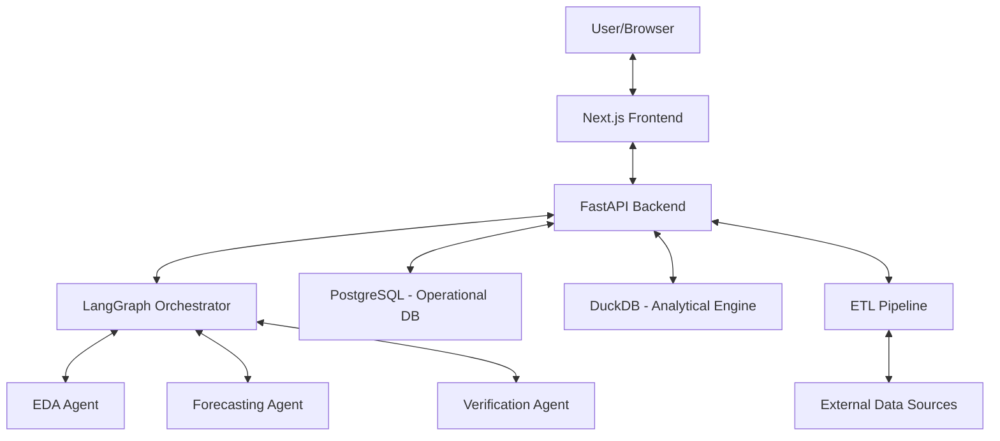

# OmniChain AI: End-to-End Platform Guide

## 1. Executive Summary
OmniChain AI is a next-generation Supply Chain Intelligence platform. It leverages a **Multi-Agent Orchestration Layer** to transform raw operational data into actionable strategic insights. Unlike traditional dashboards that only visualize the past, OmniChain AI interprets data, predicts future trends, and proactively recommends optimizations.

---

## 2. Technical Architecture Overview
The platform is built on a modern, decoupled stack designed for high-performance data processing and secure AI interactions.

---

## 3. Core Components Breakdown

### A. The Orchestration Layer (`agents/orchestrator.py`)
This is the "Brain" of the system. Powered by **LangGraph**, it routes user queries to the appropriate specialized agent.
- **Guardrails**: Every query is first checked for prompt injection or malicious intent.
- **Routing**: Logic determines if a query needs statistical analysis (EDA) or time-series prediction (Forecasting).

### B. Specialized Agents
1. **EDA Agent (`agents/eda_agent.py`)**: 
   - Uses the **AutomatedEDA** engine to profile data.
   - Detects outliers using Z-score and IQR methods.
   - Summarizes data health (missing values/correlations).
2. **Forecasting Agent (`agents/forecasting_agent.py`)**:
   - Uses **DemandForecaster** (ML) to run linear trend analysis.
   - Predicts upcoming periods based on historical sales.
   - Identifies "Upward" or "Downward" market trends.

### C. Data Engines
- **DuckDB (`pipelines/etl.py`)**: An in-process analytical database used for lightning-fast SQL queries on large CSV/DataFrame sets. It enables real-time AI analysis without taxing the primary operational database.
- **PostgreSQL**: Stores persistent data like user roles, security audit logs, and verified agent responses.

---

## 4. Integration Strategy
OmniChain AI is designed to sit *on top* of existing systems without replacing them.

- **Ingestion**: The platform can ingest data via REST APIs, Webhooks, or batch CSV uploads.
- **Transformation**: The ETL pipeline standardizes disparate data from sources like Shopify, SAP, or FedEx into a unified schema for the agents to understand.
- **Accessibility**: Because the intelligence layer is decoupled from the storage layer, it can be "plugged into" any WMS or ERP system within days.

---

## 5. Security & Verification
Trust is critical in supply chain.
- **Output Verification Agent**: Scans every AI response to ensure it doesn't leak sensitive data and strictly adheres to the provided statistical evidence.
- **AI Protection Layer**: Prevents "jailbreaking" or unauthorized data access through prompt engineering.

---

## 6. Business Value (The "Why")
- **Efficiency**: Reduces manual data manipulation by up to 80% through automated profiling.
- **Resilience**: Anticipates stockouts up to 30 days in advance.
- **Agility**: Allows non-technical managers to "ask" their data questions in plain English instead of waiting for IT reports.

---

## 7. Explainable AI (XAI) for Supply Chain
Supply chain decisions represent millions of dollars in capital. Users must trust the "Why" behind an AI's recommendation.

- **Plain English Insights**: The platform translates complex statistical models (like Z-scores or Linear Regressions) into common terminology (e.g., "Seasonal Trend" or "Unusual Spike").
- **Transparency**: Instead of just giving a number, the agent explains the logic: "I compared your last 90 days of sales against historical seasonality to identify this 15% growth trend."
- **Data Awareness**: Every analysis is performed in real-time against the latest snapshot of your operational database, ensuring that the AI is never "hallucinating" on stale data.
